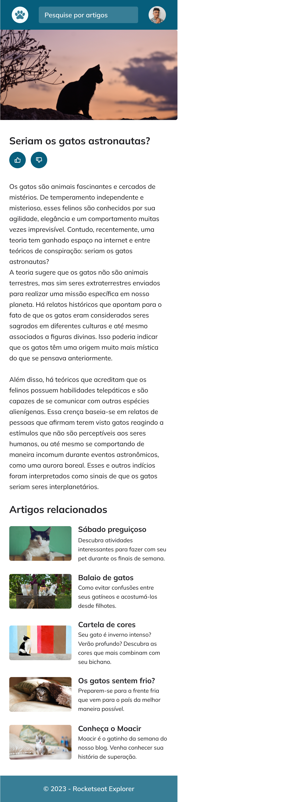

## Blog de Gatos

#### Project built by Gabriel Souza Leite based on the Rocketseat challenge

#### The project is designed for mobile and desktop users, being a responsive website that meets the needs of both screens

### Links:
  
  

### Mobile Version

### Desktop Version

